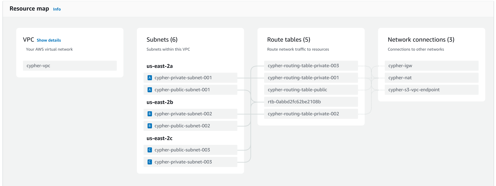

# Terraform VPC Project

This project creates a VPC using Terraform.



## Overview

The project uses Terraform to create and manage a Virtual Private Cloud (VPC) on AWS, including public and private subnets and other network configurations.

## Usage

1. **Clone the repository**:

   ```bash
   git clone https://your-repo-url
   cd terraform-vpc


## To Do

- [ ] EKS: Set up Elastic Kubernetes Service (EKS) for container orchestration.

- [ ] EKS Nodes: Add worker nodes to the Kubernetes cluster.

- [ ] Blockchain Nodes: Set up nodes for blockchain infrastructure.

- [ ] Blockscout Nodes: Deploy Blockscout nodes to explore the blockchain.

- [ ] Frontend Infrastructure: Provision infrastructure to host frontend applications.